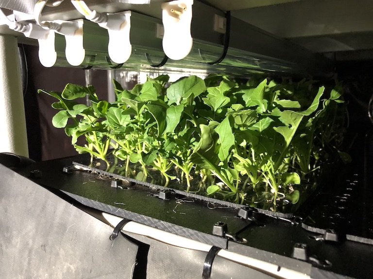

# TechnoArugula
The TechnoArugula project is a small high pressure aeroponics project built around a simple Arduino micro controller board controlling a high pressure aeroponics pump system.  The objective of this project is to demonstrate the feasability of growing fresh salad greens in a DIY, controlled environment.

## Materials
- high pressure pump
- high pressure accumulator
- filter cannister
- misting nozzles
- high pressure tubing
- high pressure fittings
- high pressure solenoid valves
- grow lights
- plant support trays
- 1/2" PVC Pipe
- 1/2" PVC Pipe Fittings
- Pond liner

## Teaser, what I've been growing

*###Fifth harvest of Arugula*

## Putting it Together
This is how I built it.

## The Code
TechnoArugula is a simple Arduino ini file that makes use of a relatively simple state machine to allow asynchronous execution of on/off for each valve and for testing and controlling temperature and CO2 levels.  Basically each state is represented by a task function such as timerTask1StartFunction or timerTask1EndFunction.  Each state function checks to see if it's current state should end by checking "millis()" against an end time.  When the state has expired it executes it's task (eg turning a valve on or off), sets the next state function and the next end time for that state and returns.
For example, timerTask1StartFunction waits for it timer to end and then turns on it's valve, sets the end time to the current time plus a half second and sets the state to timerTask1EndFunction.  The current state function is executed in the loop along with other tasks and because none of the state functions ever calls delay() other tasks can execute while something like a valve is on.

## What's next
- Making better root chambers
- Adding CO2 enrichment
- Adding cooling
- Adding external control of spray timing, cooling and CO2 enrichment.
